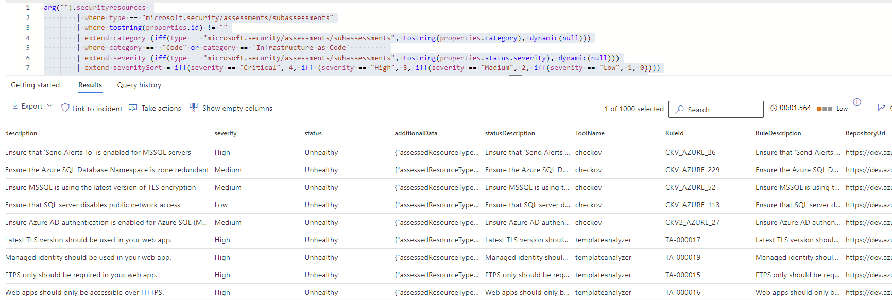

# Azure DevOps Security - Code Scanning Recommendations

## Query Information

### Description

Use the below queries to list all Azure DevOps *Code* and *Infrastructure as code* recommendations.



### References

- [Agentless code scanning in Microsoft Defender for Cloud](https://learn.microsoft.com/en-us/azure/defender-for-cloud/agentless-code-scanning)
- [Scan your connected GitHub repository or Azure DevOps project](https://learn.microsoft.com/en-us/azure/defender-for-cloud/iac-vulnerabilities)
- [Security recommendations for DevOps resources](https://learn.microsoft.com/en-us/azure/defender-for-cloud/recommendations-reference-devops)

### Tools

- [Bandit](https://github.com/PyCQA/bandit)
- [Checkov](https://github.com/bridgecrewio/checkov)
- [ESLint](https://github.com/eslint/eslint)
- [Template Analyzer](https://github.com/Azure/template-analyzer)
- [Terrascan](https://github.com/accurics/terrascan)

## Queries

### Azure Resource Graph Explorer

```kql
securityresources 
        | where type == "microsoft.security/assessments/subassessments"
        | where tostring(properties.id) != ""
        | extend category=(iff(type == "microsoft.security/assessments/subassessments", tostring(properties.category), dynamic(null)))
        | where category ==  "Code" or category == 'Infrastructure as Code'         
        | extend severity=(iff(type == "microsoft.security/assessments/subassessments", tostring(properties.status.severity), dynamic(null)))
        | extend severitySort = iff(severity == "Critical", 4, iff (severity == "High", 3, iff(severity == "Medium", 2, iff(severity == "Low", 1, 0))))
        | extend subAssessmentName=(iff(type == "microsoft.security/assessments/subassessments", tostring(properties.displayName), dynamic(null))),
            description=(iff(type == "microsoft.security/assessments/subassessments", tostring(properties.description), dynamic(null))),
            status=(iff(type == "microsoft.security/assessments/subassessments", tostring(properties.status.code), dynamic(null))),
            statusDescription=(iff(type == "microsoft.security/assessments/subassessments", tostring(properties.status.description), dynamic(null))),
            resourceDetails=(iff(type == "microsoft.security/assessments/subassessments", tostring(properties.resourceDetails), dynamic(null))),
            timeGenerated=(iff(type == "microsoft.security/assessments/subassessments", todatetime(properties.timeGenerated), dynamic(null))),
            additionalData=(iff(type == "microsoft.security/assessments/subassessments", (properties.additionalData),dynamic(null))),
            ToolName=(iff(type == "microsoft.security/assessments/subassessments", tostring(properties.additionalData.data.ToolName), dynamic(null))),
            RuleId=(iff(type == "microsoft.security/assessments/subassessments", tostring(properties.additionalData.data.RuleId), dynamic(null))),
            RuleDescription=(iff(type == "microsoft.security/assessments/subassessments", tostring(properties.additionalData.data.RuleDescription), dynamic(null))),
            RepositoryUri=(iff(type == "microsoft.security/assessments/subassessments", tostring(properties.additionalData.data.RepositoryUri), dynamic(null))),
            File=(iff(type == "microsoft.security/assessments/subassessments", tostring(properties.additionalData.data.File), dynamic(null))),
            Line=(iff(type == "microsoft.security/assessments/subassessments", tostring(properties.additionalData.data.Line), dynamic(null)))
      | project timeGenerated, severitySort, category, resourceDetails, subAssessmentName, description, severity, status, additionalData,  statusDescription, ToolName, RuleId, RuleDescription,RepositoryUri, File,Line
        
```

### Defender XDR Advanced Hunting

```kql
arg("").securityresources 
        | where type == "microsoft.security/assessments/subassessments"
        | where tostring(properties.id) != ""
        | extend category=(iff(type == "microsoft.security/assessments/subassessments", tostring(properties.category), dynamic(null)))
        | where category ==  "Code" or category == 'Infrastructure as Code'         
        | extend severity=(iff(type == "microsoft.security/assessments/subassessments", tostring(properties.status.severity), dynamic(null)))
        | extend severitySort = iff(severity == "Critical", 4, iff (severity == "High", 3, iff(severity == "Medium", 2, iff(severity == "Low", 1, 0))))
        | extend subAssessmentName=(iff(type == "microsoft.security/assessments/subassessments", tostring(properties.displayName), dynamic(null))),
            description=(iff(type == "microsoft.security/assessments/subassessments", tostring(properties.description), dynamic(null))),
            status=(iff(type == "microsoft.security/assessments/subassessments", tostring(properties.status.code), dynamic(null))),
            statusDescription=(iff(type == "microsoft.security/assessments/subassessments", tostring(properties.status.description), dynamic(null))),
            resourceDetails=(iff(type == "microsoft.security/assessments/subassessments", tostring(properties.resourceDetails), dynamic(null))),
            timeGenerated=(iff(type == "microsoft.security/assessments/subassessments", todatetime(properties.timeGenerated), dynamic(null))),
            additionalData=(iff(type == "microsoft.security/assessments/subassessments", (properties.additionalData),dynamic(null))),
            ToolName=(iff(type == "microsoft.security/assessments/subassessments", tostring(properties.additionalData.data.ToolName), dynamic(null))),
            RuleId=(iff(type == "microsoft.security/assessments/subassessments", tostring(properties.additionalData.data.RuleId), dynamic(null))),
            RuleDescription=(iff(type == "microsoft.security/assessments/subassessments", tostring(properties.additionalData.data.RuleDescription), dynamic(null))),
            RepositoryUri=(iff(type == "microsoft.security/assessments/subassessments", tostring(properties.additionalData.data.RepositoryUri), dynamic(null))),
            File=(iff(type == "microsoft.security/assessments/subassessments", tostring(properties.additionalData.data.File), dynamic(null))),
            Line=(iff(type == "microsoft.security/assessments/subassessments", tostring(properties.additionalData.data.Line), dynamic(null)))
      | project timeGenerated, severitySort, category, resourceDetails, subAssessmentName, description, severity, status, additionalData,  statusDescription, ToolName, RuleId, RuleDescription,RepositoryUri, File,Line
```
