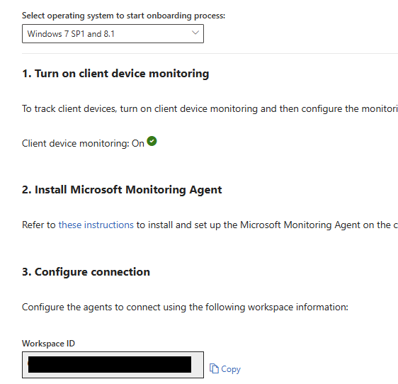

# Microsoft Defender for Endpoint - Microsoft Monitoring Agent Cleanup

## Query Information

### Description

On 31. August 2024, Microsoft has retired the Log Analytics Agent. If you have Windows Server 2012-R2 or Windows Server 2016 in use, consider installing the unified agent for Defender for Endpoint.

Ingestion for MMA will be unchanged until February 1, 2025. After this date, cloud ingestion services will gradually reduce support for MMA agents, which may result in decreased support and potential compatibility issues for MMA agents over time.

Use the queries below to identify any MMA Agents on your systems that run Defender processes through the MMA Agent or still communiate with the MDE Workspace.

### Update the Query

You will need your Defender for Endpoint Worspace ID. You'll find this by going to the Defender for Endpoint Settings, Onboarding Settnigs, and then select Windows 7 as the OS.



Update the variable withn the KQL query with your Workspace ID.

```kql
let workspaceid = 'xxxxxxxx-xxxx-xxxx-xxxx-xxxxxxxx';
```

#### References

- [Prepare for retirement of the Log Analytics agent](https://learn.microsoft.com/en-us/azure/defender-for-cloud/prepare-deprecation-log-analytics-mma-agent)
- [On 31 August 2024, we'll retire the Log Analytics agent that you use in Azure Monitor.](https://azure.microsoft.com/en-us/updates?id=were-retiring-the-log-analytics-agent-in-azure-monitor-on-31-august-2024)
- [Updating MMA on Windows devices for Microsoft Defender for Endpoint](https://learn.microsoft.com/en-us/defender-endpoint/update-agent-mma-windows)

### Microsoft 365 Defender

Show all devices that are still communicating with the MDE Workspace

```kql
let workspaceid = 'xxxxxxxx-xxxx-xxxx-xxxx-xxxxxxxx';
 DeviceNetworkEvents
   | where InitiatingProcessFolderPath matches regex @"c:\\program files\\microsoft monitoring agent\\agent\\"
| where RemoteUrl contains (workspaceid)
| summarize make_set(RemoteUrl), make_set(InitiatingProcessFileName) by DeviceName
```

Show all devices where there are still MMA Agent based defender processes active.

```kql
let targetProcesses = dynamic(["pmfexe.exe", "mssenses.exe", "tvmdownlevelcollector.exe"]);
DeviceProcessEvents
 | where InitiatingProcessFolderPath matches regex @"c:\\program files\\microsoft monitoring agent\\agent\\health service state\\monitoring host temporary files"
 | where InitiatingProcessFileName has_any (targetProcesses)
 | summarize  make_set(InitiatingProcessFileName) by DeviceName
```
